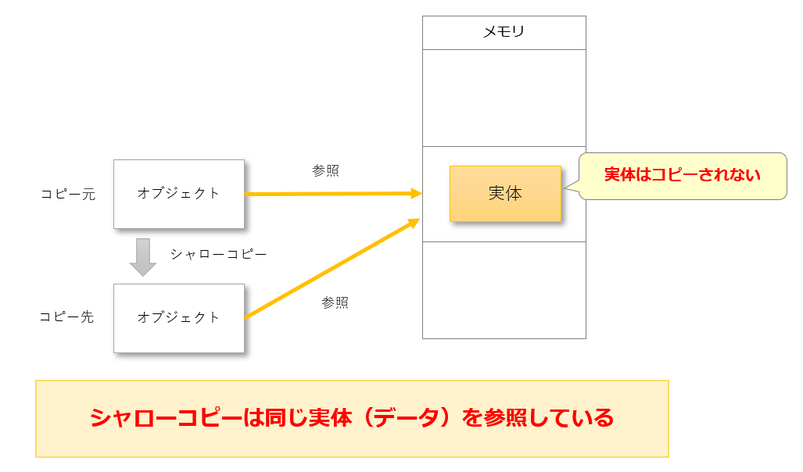

# Javaコーディング規約

**第1.0版**

| 項目 | 内容 |
| --- | --- |
| 作成者 | 先端技術本部　上田（剛） |
| 作成日 | 2026/05/15 |
| 最終更新日 | |

### 変更履歴

| No. | 変更日 | 区分 | 変更箇所 | 変更内容 | 作成・更新者 |
| --- | --- | --- | --- | --- | --- |
| 1 | 2026/05/15 | 新規 | | 原本のdocx内容をMarkDown化 | 上田（剛） |

---

## 目次

- [Javaコーディング規約](#javaコーディング規約)
    - [変更履歴](#変更履歴)
  - [目次](#目次)
  - [はじめに](#はじめに)
    - [前提](#前提)
    - [指標](#指標)
      - [ランタイムエラーよりもコンパイルエラー](#ランタイムエラーよりもコンパイルエラー)
      - [変更可能な状態を減らす](#変更可能な状態を減らす)
      - [状態の変更箇所を局所化する](#状態の変更箇所を局所化する)
    - [Javaバージョン](#javaバージョン)
    - [表記ルール](#表記ルール)
  - [パッケージ構成](#パッケージ構成)
    - [命名規則](#命名規則)
      - [ドメイン名の逆順](#ドメイン名の逆順)
      - [小文字のみ](#小文字のみ)
      - [意味のある名前](#意味のある名前)
      - [単語の区切り](#単語の区切り)
      - [予約語の回避](#予約語の回避)
      - [短く簡潔に](#短く簡潔に)
  - [クラス・メソッド・変数命名](#クラスメソッド変数命名)
    - [クラス名](#クラス名)
    - [メソッド名](#メソッド名)
    - [変数](#変数)
    - [データモデルの「用語辞典」](#データモデルの用語辞典)
  - [コメント](#コメント)
    - [クラスのJavadocコメント](#クラスのjavadocコメント)
    - [フィールドのJavaDocコメント](#フィールドのjavadocコメント)
    - [メソッドのJavaDocコメント](#メソッドのjavadocコメント)
    - [行コメント](#行コメント)
  - [禁止事項](#禁止事項)
    - [計算式の途中でインクリメント・デクリメントをしない](#計算式の途中でインクリメントデクリメントをしない)
    - [フィールドを一時変数として使用しない](#フィールドを一時変数として使用しない)
    - [スーパークラスと同名のフィールドをサブクラスで定義しない](#スーパークラスと同名のフィールドをサブクラスで定義しない)
    - [戻り値がコレクションや配列の場合は null を返さない](#戻り値がコレクションや配列の場合は-null-を返さない)
    - [コンストラクタ内で自分自身のインスタンスメソッドを呼び出さない](#コンストラクタ内で自分自身のインスタンスメソッドを呼び出さない)
    - [インスタンス変数をレシーバとしたstatic メソッド呼び出しをしない](#インスタンス変数をレシーバとしたstatic-メソッド呼び出しをしない)
    - [インスタンス変数をレシーバとしたstatic メソッド参照をしない](#インスタンス変数をレシーバとしたstatic-メソッド参照をしない)
    - [独自例外クラスを実装しない](#独自例外クラスを実装しない)
    - [java.lang.Exceptionクラスのインスタンスを生成してスローをしない](#javalangexceptionクラスのインスタンスを生成してスローをしない)
    - [try-catch 文を条件分岐のために使用しない](#try-catch-文を条件分岐のために使用しない)
    - [秘匿情報はログ出力やシリアライズされないように注意すること](#秘匿情報はログ出力やシリアライズされないように注意すること)
    - [Java標準ライブラリにあるレガシーなAPIは使用しない](#java標準ライブラリにあるレガシーなapiは使用しない)
    - [リフレクションを直接使用しない](#リフレクションを直接使用しない)
    - [クラスを不整合な状態にしない](#クラスを不整合な状態にしない)
    - [独自非同期クラスを実装しない](#独自非同期クラスを実装しない)
    - [名前と値が同じ定数は作成しない](#名前と値が同じ定数は作成しない)
  - [注意事項](#注意事項)
    - [メソッドには名前から想像できない処理を実装しない](#メソッドには名前から想像できない処理を実装しない)
    - [単一のメソッドに複数の要素を詰め込まない](#単一のメソッドに複数の要素を詰め込まない)
    - [クラス外に公開されるメソッドの引数や戻り値・フィールドの型は実装クラスではなくインターフェースで宣言すること](#クラス外に公開されるメソッドの引数や戻り値フィールドの型は実装クラスではなくインターフェースで宣言すること)
    - [メソッドのオーバーロードはオプションの省略用途のみに使用すること](#メソッドのオーバーロードはオプションの省略用途のみに使用すること)
    - [未使用コードは残したままにしない](#未使用コードは残したままにしない)
    - [クラスは大きくなりすぎないようにする](#クラスは大きくなりすぎないようにする)
    - [メソッドは大きくなりすぎないようにする](#メソッドは大きくなりすぎないようにする)
    - [インナークラスやstaticにネストしたクラス、匿名クラスは作りすぎない](#インナークラスやstaticにネストしたクラス匿名クラスは作りすぎない)
    - [可能な限りキャストは使用しない](#可能な限りキャストは使用しない)
    - [アンボクシングの注意事項](#アンボクシングの注意事項)
    - [計算の誤差が許されない場合はBigDecimalを使用すること](#計算の誤差が許されない場合はbigdecimalを使用すること)
    - [ソートと集計はJava側ではなく、SQLで行うようにする](#ソートと集計はjava側ではなくsqlで行うようにする)
    - [ループ処理の中では極力データベースアクセスしないようにする](#ループ処理の中では極力データベースアクセスしないようにする)
    - [外部からの入力値は共通部品を用いてチェックする](#外部からの入力値は共通部品を用いてチェックする)
    - [ファイルの入出力は共通部品のクラスを使用すること](#ファイルの入出力は共通部品のクラスを使用すること)
    - [リソースをクローズする必要がある場合はtry-with-resources構文を使用すること](#リソースをクローズする必要がある場合はtry-with-resources構文を使用すること)
    - [例外処理はプロジェクトの方式設計に従って統一的にコーディングすること](#例外処理はプロジェクトの方式設計に従って統一的にコーディングすること)
    - [ループのネストはなるべく少なくすること](#ループのネストはなるべく少なくすること)
  - [推奨事項](#推奨事項)
    - [クラスやメソッドなどには適切なアクセス修飾子を付与する](#クラスやメソッドなどには適切なアクセス修飾子を付与する)
    - [インスタンス変数は原則 private に設定する](#インスタンス変数は原則-private-に設定する)
    - [ローカル変数はできるだけ狭いスコープで使用する](#ローカル変数はできるだけ狭いスコープで使用する)
    - [なるべく再代入は避けて、finalを活用する](#なるべく再代入は避けてfinalを活用する)
    - [引数の状態をなるべく変えない](#引数の状態をなるべく変えない)
    - [戻り値として null を使いたい場合、Optional の使用を検討する](#戻り値として-null-を使いたい場合optional-の使用を検討する)
    - [コレクション等の型パラメーターを取るクラスを使用する場合はバインドを活用する](#コレクション等の型パラメーターを取るクラスを使用する場合はバインドを活用する)
    - [コレクション処理時のStream API活用を検討する](#コレクション処理時のstream-api活用を検討する)
    - [チェック例外のスローを伴う処理はStream APIではなく拡張for文を活用する](#チェック例外のスローを伴う処理はstream-apiではなく拡張for文を活用する)
    - [コレクションの順次処理にはレガシーfor文はなるべく使用しない](#コレクションの順次処理にはレガシーfor文はなるべく使用しない)
    - [配列全体をコピーする場合はcloneメソッドを使用する](#配列全体をコピーする場合はcloneメソッドを使用する)
    - [コレクションを配列に変換する場合はtoArrayメソッドを使用する](#コレクションを配列に変換する場合はtoarrayメソッドを使用する)
    - [配列をコレクションに変換する場合はコレクションのofメソッドを使用する](#配列をコレクションに変換する場合はコレクションのofメソッドを使用する)
    - [メソッドのオーバーライドや、抽象メソッドを実装する場合はメソッドに@Overrideを付与する](#メソッドのオーバーライドや抽象メソッドを実装する場合はメソッドにoverrideを付与する)
    - [複数行の文字列定義はテキストブロックが使用できるか検討する](#複数行の文字列定義はテキストブロックが使用できるか検討する)
    - [変数に代入する値を分岐で切り替えている場合、switch式を検討する](#変数に代入する値を分岐で切り替えている場合switch式を検討する)

---

## はじめに

本規約はJavaを使用してアプリケーションを開発するプロジェクトにおいて、アプリケーションプログラマーが守るべき
ルールやより良いコードを書くための指針を解説しています。

基本的に特定のフレームワークに限らず汎用的に使用できるようにしてあります。

### 前提

本規約が対象とするコードは、次の3つが実施されていることを前提としています。

- コードフォーマッターでフォーマットしていること（Javaコードフォーマッター）
- Checkstyleで機械的に検出できる規約違反は解消していること（Checkstyleガイド）
- SpotBugsで明らかに問題のあるコードや、後々問題が発生しそうなコードを排除していること（SpotBugsガイド）

機械的に対処できることは予め実施し、本規約ではより良いコードを書くためのガイド、あるいはコードレビューの指針となるように作成しました。

なお著名な静的解析ツールは他にもSonarQubeがありますが、サーバーへインストールする形式の
SonarQubeよりもMavenの実行だけでチェックが完結するCheckstyleとSpotBugsの方が導入の敷居が
低いため、本規約ではCheckstyleとSpotBugsを前提にしています。

プロジェクトによってはCheckstyle・SpotBugs以外の手段で静的解析をする場合もあるでしょう。
必要に応じて、規約の前提条件をCheckstyle・SpotBugsからSonarQubeやその他の静的解析ツールに
読み換えるようにしてください。

### 指標

本規約を書くにあたって、次の3つを指標としました。

- ランタイムエラーよりもコンパイルエラー
- 変更可能な状態を減らす
- 状態の変更箇所を局所化する

#### ランタイムエラーよりもコンパイルエラー

アプリケーションを実際に動かさないと発見できないバグよりも、コンパイル時にエラーとなって発見できるバグの方が素早く修正できます。

ランタイムエラーに頼らず、なるべくコンパイルエラーでバグを発見できるようなコーディングを心がけることで
安心感をもって開発を進められます。

#### 変更可能な状態を減らす

変更可能な状態とは、setterなどのメソッドによって再代入できるフィールドや、
java.lang.StringBuilderのように値を変更できるクラスで宣言されたフィールドを指します。

```java
//setterで変更できるフィールド（変更可能な状態）
private String mutableState;

public void setMutableState(final String mutableState) {
    this.mutableState = mutableState;
}
```

```java
//フィールドは再代入できないが、値は変更できる（変更可能な状態）
private final StringBuilder mutableState = new StringBuilder();

public void appendHello(final String yourName) {
    //値を変更している
    mutableState.append("Hello ").append(yourName);
}
```

変更可能な状態がある場合、現在の状態がどうなっているか頭の中で覚えながらコードを読み進めなくては
いけません。

人それぞれですが、一時的に頭の中で覚えておける情報量はそれほど多くありません。
なるべく変更可能な状態を減らすことで、読み手に負担をかけず保守しやすいコードになります。

#### 状態の変更箇所を局所化する

setterなどで状態を変更することがありますが、状態の変更前後で頭の中で覚えている状態も変更しないと
いけません。
状態を変更するコードをなるべく近い場所にまとめることで、読み手に負担をかけず保守しやすいコードになります。
本規約はこの指標に則ったコードを書くためにはどのような事に気を配れば良いのかを意識して作成しました。

本規約を読み進める際も、また実際にコードを書く際も、この指標を意識しておくとより効果的になります。

### Javaバージョン

本規約はJava21をベースに作成しています。

### 表記ルール

本規約ではJavaのバージョンをJ2SE 5やJava SE 8とは書かずに、単にJava 5やJava 8と記載しています。

規約の解説中にコード例を掲載することがあります。 やってはいけない「禁止コード」の例は
先頭に//NGと一行コメントの形式で記載しています。

禁止コードとの対比として挙げている、やってもよい・ぜひやるべき「推奨コード」の例は
先頭に//OKと記載しています。 //NGと//OKのどちらも記載されていないコード例は
「推奨コード」か、もしくは単なる解説の補助として掲載しています。

コード例の中で、特に見せたい箇所以外は省略する場合があります。 その際は ... と書いて省略を表しています。

```java
//省略の例
public void someMethod(...) { //引数の記載を省略
    ... //メソッド本体の記載を省略
}
```

また、縦に伸びているコード例を中略する場合は . を縦に3つ書いて表していることがあります。

```java
//中略の例
final String text = message.getText();
.
.
.
return text;
```

本規約ではループインデックスを伴う昔ながらのfor文を、「レガシーfor文」と表現しています。

```java
//レガシーfor文の例
for (int i = 0; i < length; i++) {
    ...
}
```

コード例は本規約、特に「7.推奨事項」で挙げられている規約に従っているため、次のような特徴があります。

- フィールドにはprivateを付けている
- 変数には可能な限りfinalを付けている

他にも従っている規約はありますが、詳細は「7.推奨事項」を参照してください。
なお「禁止コード」の例を示すため、一部のコード例では規約に従っていないものもあります。

---

## パッケージ構成

アプリケーションのパッケージ構成についての規約です。

### 命名規則

業務アプリケーションでは方式設計上のステレオタイプに従ってパッケージを構成してください。
パッケージ名の簡単な例を示します。

| 役割 | 命名例 |
| --- | --- |
| アクション | com.example.action |
| エンティティ | com.example.entity |
| 業務フォーム | com.example.form |
| バリデーター | com.example.validation |
| DTO | com.example.dto |

方式設計上にパッケージ構成の指定がない場合は、一般的なパッケージ命名規則に準拠するものとします。
以下に、命名規則を挙げておきます。

#### ドメイン名の逆順

パッケージ名は通常、組織のドメイン名を逆順にして始めます。例えば、example.comならcom.exampleとなります。

#### 小文字のみ

パッケージ名はすべて小文字で記述します。大文字は使用しません。
例: com.example.project

#### 意味のある名前

パッケージ名は、その中に含まれるクラスやインターフェースの内容を示す意味のある名前にします。
例: com.example.utils（ユーティリティクラスを含む）

#### 単語の区切り

単語の区切りにはピリオド（.）を使用します。
例: com.example.myapp.services

#### 予約語の回避

Javaの予約語や既存の標準ライブラリのパッケージ名と衝突しないようにします。
例: java, javax, org, com.sunなどは避ける。

#### 短く簡潔に

パッケージ名は短く、簡潔に保つことが望ましいです。

---

## クラス・メソッド・変数命名

クラスやメソッド、変数の命名についての規約です。

### クラス名

クラス名は基本的には名詞にします。

慣習的に「特定の能力を付与することを表すインターフェース」は、末尾にableを付ける事があります。
Java標準APIにもそのような名前のインターフェースがいくつも含まれています。

java.lang.Appendable
java.lang.AutoCloseable
java.lang.Comparable
java.lang.Iterable
java.lang.Runnable

業務アプリケーションで作成するクラスは方式設計上のステレオタイプに従った役割を持っていることが多いです。
そのため、ステレオタイプに対応していることが分かるような接尾語を付けるなどして命名をしてください。

| 役割 | 命名ルール |
| --- | --- |
| アクション | 機能を表す名前 + Action |
| エンティティ | テーブルの物理名をアッパーキャメルケースにしたもの |
| 業務ベースフォーム | 機能を表す名前 + FormBase |
| 業務フォーム | 機能を表す名前 + Form |
| バリデーター | 機能を表す名前 + Validator |
| DTO | データの種類を表す名前 + Dto |
| 排他制御の制御クラス | テーブルの物理名をアッパーキャメルケースにしたもの + ExclusiveControl |
| テストクラス | テスト対象クラス名 + Test |
| リクエスト単体テスト | Actionクラス名 + RequestTest |

### メソッド名

メソッド名は動詞から始まるように命名します。

次に示す「機能別の推奨命名ルール」には動詞から始まらないものも含んでいます。

| 機能 | 命名ルール | 例 |
| --- | --- | --- |
| インスタンスを生成する | create + 対象 | createItemCode |
| 異なる型に変換する | to + 変換先の型 | toString toItemCode |
| 異なる型として扱う | as + 扱う型 | asReadLock asList |
| 含んでいるかどうかを返す | contains + 対象 | containsKey |
| 可能かどうかを返す | can + 動作 | canRead canEncode |
| その状態かどうかを返す | is + 状態 | isClosed isEmpty |

「異なる型に変換する」と「異なる型として扱う」は同じように見えますが、少し異なります。
前者は「異なる型に変換してしまって元の型の性質は期待しない」のに対して、
後者は「異なる型に変換するが元の型の性質と関連する」ものです。

Java標準APIで言うと、前者にあたるのはInteger.toStringです。整数が文字列に変換されて、整数の性質は
期待されません。
後者にあたるのはArrays.asListです。配列がリストに変換されますが、配列とリストは性質が似ていますし、元の配列を変更するとリストも変更されます。

Java標準APIを見てもString.lengthやOptional.ofのように動詞から始まらない名前のメソッドがいくつも存在します。 Java標準APIも参考にして、適切に命名するようにしてください。

### 変数

フィールド名やローカル変数名は基本的には名詞にします。
Javaの命名規則の慣習上、決まった名前を付ける場合があります。
java.io.InputStreamやjava.io.OutputStreamは、それぞれ in is や out osと命名しても構いません。

```java
try (final InputStream in = openInputStream(file)) {
    ...
}
```

レガシーfor文で使用するカウンターはiと命名することが一般的です。

```java
for (int i = 0; i < length; i++) {
    ...
}
```

catchブロックで例外を受け取る変数はeと命名することが一般的です。
また、値を組み立てるために一時的に使用されるスコープの狭い変数は意味の無い名前でも構いません。

```java
//メッセージを組み立てるための一時変数
//ここではbufという無意味な名前を付けている
//sbやtempといった名前でも良い
final StringBuilder buf = new StringBuilder();
buf.append("Hello, ");
buf.append(yourName);
buf.append("!");
final String message = buf.toString();
```

### データモデルの「用語辞典」

整理された用語辞書をもとにすると、統一感のある命名が出来ます。
請負先のお客さまでデータモデルの「用語辞典」がある場合、それを用いて命名を行うようにしましょう。

用語辞書が整理されていない場合は、まず用語辞書の整理をすることを検討してみてください。

---

## コメント

Javadocコメントや処理の説明をするためのコメントに関する規約です。

### クラスのJavadocコメント

クラスのJavadocコメントには、そのクラスの役割を記載してください。
プロジェクトのルールに応じて@authorや@sinceなども記載してください。

```java
/**
 * 商品情報を表すクラスです。
 * 
 * @author t-ueda (ATP)
 */
public class Item {
```

### フィールドのJavaDocコメント

フィールドのJavadocコメントには、それがどのような属性を表すものなのか、記載してください。

```java
/**
 * 商品コード
 */
private String code;

/**
 * 商品の名称
 */
private String name;

/**
 * 更新日時
 */
private LocalDateTime updatedAt;
```

### メソッドのJavaDocコメント

メソッドのJavadocには、そのメソッドが行う処理の概要を記載してください。
また、そのメソッドを呼び出す上で前提条件があれば、それも記載してください。

@paramで引数の説明を、@returnで戻り値の説明を、@throwsでスローされる可能性がある例外の説明を
記載してください。

@throwsでは例外クラスの日本語名だけを書いて済ませてはいけません。
該当の例外がスローされるのはどのような場合かを記載してください。

```java
//NG 例外クラスの名前を記載しているだけなのでNG。
 ...
 * @throws ItemNotFoundException 商品Not Found例外
 */
//OK 例外がスローされるのはどのような場合か記載している。
 ...
 * @throws ItemNotFoundException 更新対象の商品がデータベース内に見つからな場合
 */
```

次に示す引数と戻り値におけるnullの扱いは、アプリケーション全体のデフォルトがどちらなのかを
プロジェクトで決めてください。

引数にnullを許可する、もしくは許可しない
戻り値としてnullを返される場合がある、もしくは必ずnullでない値が返る
そしてデフォルトから外れる場合のみ、その旨をJavadocへ記載するようにしてください。
例えば、「デフォルトでは引数にnullを許可しない」とルールを決めた場合、nullを受け取れる引数にはnullを受け取るとどのように振舞うのかを記載してください。

```java
/**
 * 商品情報を更新します。
 *
 * <p>
 * このメソッドでは既に登録済みの商品に対して更新を行います。
 * まだ商品を登録していない場合は、先に登録処理を行ってください。
 * </p>
 *
 * @param code 商品コード
 * @param name 商品の名称
 * @param updatedAt 更新日時。nullの場合はデフォルト値としてシステム日時が使用される
 * @throws ItemNotFoundException 更新対象の商品がデータベース内に見つからない場合
 */
public void updateItem(final String code, final String name, final LocalDateTime updatedAt)
        throws ItemNotFoundException {
    ...
}
```

### 行コメント

コードだけを読んで処理の内容を理解できるのが理想的ですが、複雑なロジックや、パフォーマンスのためにあえて特殊な実装をした場合は説明のコメントを記載してください。

また、なぜこのような実装にしているのかといった経緯を説明した方が理解しやすいコードである場合にも
説明のコメントを記載してください。

コメントは//から始まる一行コメントの形式で記載してください。

```java
    //一時変数はローカル変数を使用して、メソッドに渡して引き回している
    final List<String> itemNames = new ArrayList<>();
```

---

## 禁止事項

バグを発生させそうな危ういコードを減らすため、禁止事項を定めます。

### 計算式の途中でインクリメント・デクリメントをしない

計算式の途中でインクリメント・デクリメントをすると、該当の変数の値が分かりにくくなります。
計算式は計算式で済ませてしまって、そのあとインクリメント・デクリメントをするようにしてください。

```java
//NG
int x = ...
int y = (x++ * height) / width;
//OK
int x = ...
int y = (x * height) / width;
x++;
```

### フィールドを一時変数として使用しない

コレクションの要素を順次処理して必要な値を構築するメソッドなどで中間状態を保持するために一時変数を導入することがありますが、その場合にフィールドを使用しないでください。

フィールドを使用するとクラスが持つ状態を増やすことになります。
なるべく変更可能な状態は持たないようにするためにも、一時変数の用途でフィールドは使用しないでください。
一時変数の用途にはフィールドではなく、ローカル変数を使用してください。

```java
//NG
//フィールドを一時変数として使用している
private List<String> itemNames;

public String collectNames(final List<Item> items) {
    this.itemNames = new ArrayList<>();
    for (Item item : items) {
        collectName(item);
    }
    return this.itemNames.stream().collect(Collectors.joining(", "));
}

private void collectName(final Item item) {
    this.itemNames.add(item.getName());
}
//OK
public String collectNames(final List<Item> items) {
    //一時変数はローカル変数を使用して、メソッドに渡して引き回している
    final List<String> itemNames = new ArrayList<>();
    for (Item item : items) {
        collectName(itemNames, item);
    }
    return itemNames.stream().collect(Collectors.joining(", "));
}

private void collectName(final List<String> itemNames, final Item item) {
    itemNames.add(item.getName());
}
```

### スーパークラスと同名のフィールドをサブクラスで定義しない

スーパークラスに定義されているフィールドと同名のフィールドをサブクラスにも定義すると、
スーパークラスに定義されているフィールドを名前だけでアクセスできなくなります。

フィールドはメソッドと異なりオーバーライドできません。
混乱の元となるので、スーパークラスと同名のフィールドをサブクラスで定義しないでください。

```java
//NG
public class SuperClass {

    //サブクラスで使用されることが想定されているフィールド
    protected final String var;

    ...
}

public class SubClass extends SuperClass {

    private final String var;

    public String getVar() {
        return var; //SubClass.var が返される
    }

    ...
}
```

### 戻り値がコレクションや配列の場合は null を返さない

値がない状態を表すためにnullを使うことがありますが、戻り値が次に示すようなコレクションや配列の場合は
値がない状態を表すためであってもnullを返さないでください。

java.util.Collection
java.util.Set
java.util.List
java.util.Map

コレクションの値がない状態というのは、多くの場合はコレクションが空であることを指します。
コレクションには空であることを示すisEmptyというメソッドがあるので、わざわざnullを返す必要はありません。

また、配列の場合はlengthフィールドが0なら空であると判断できます。
nullを返す可能性があると、呼び出し元でnullチェックをしなくてはならずコードが複雑になります。

```java
//NG
public List<Item> findItems(final ItemCategory category) {
    List<Item> items = dao.findItems(category);
    if (items.isEmpty()) {
        return null;
    }
    return items;
}
//OK
public List<Item> findItems(final ItemCategory category) {
    return dao.findItems(category);
}
```

明示的に空のコレクションを作成して返したい場合はjava.util.Collectionsクラスにあるempty<コレクション>メソッドを使用してください。
例えば条件に応じて空のリストを返したい場合はjava.util.ArrayListをインスタンス化するのではなく、java.util.CollectionsクラスのemptyListメソッドを使用してください。

```java
//NG
if (empty) {
    return new ArrayList<>();
}
//OK
if (empty) {
    return Collections.emptyList();
}
```

java.util.CollectionsにはemptyList以外にもコレクションの種類に応じてemptySetやemptyMapが
用意されています。

### コンストラクタ内で自分自身のインスタンスメソッドを呼び出さない

コンストラクタ内では、たとえfinalが付いているフィールドであっても初期化前のnull値を参照してしまう場合が
あります。

そのため、コンストラクタからフィールドを参照するインスタンスメソッドを呼び出す場合、フィールドの初期化とメソッドの呼び出しの順番に注意する必要が出てきてしまいます。

```java
//NG
public class Foo {

    private final String text;
    private final int length;

    public Foo(final String text) {

        //textが初期化されていないのでこの位置でcalculateLengthを呼び出すと
        //NullPointerExceptionがスローされる。
        this.length = calculateLength();

        this.text = text;

        //textが初期化された後のこの位置で呼び出すべき。
        //this.length = calculateLength();
    }

    protected int calculateLength() {
        return text.length();
    }
}
```

継承を伴うと話は更に複雑化します。

次に示すNG例は、FooとBarという2つのクラスが定義されています。 BarはFooを継承しています。

Barをインスタンス化すると、Barのコンストラクタの先頭でFooのコンストラクタが呼び出されます。 FooのコンストラクタではcalculateLengthを呼び出そうとしますが、Barでオーバーライドされているので実際にはBarのcalculateLengthが呼び出されます。
BarのcalculateLengthではtextを参照していますが、この時点ではまだ初期化されていないのでNullPointerExceptionとなってしまいます。

```java
//NG
public class Foo {

    private final int length;

    public Foo() {
        //コンストラクタで自分自分のメソッドを呼び出している
        this.length = calculateLength();
    }

    protected int calculateLength() {
        return 0;
    }
}

class Bar extends Foo {

    protected final String text;

    public Bar(final String text) {
        this.text = text;
    }

    @Override
    protected int calculateLength() {
        //ここでNullPointerExceptionがスローされる
        return text.length();
    }
}
```

このような複雑さを持ち込んでしまうため、コンストラクタ内から自分自身のインスタンスメソッドを呼び出さないようにしてください。

コンストラクタ内では基本的には引数をフィールドにセットするだけにしてください。

何かしらの処理を行いたい場合は、コンストラクタ内で処理を完結させるようにしてください。

```java
//OK
public class Foo {

    private final String text;
    private final int length;

    public Foo(final String text) {
        this.text = text;
        // コンストラクタ内で処理が完結している
        this.length = text.length();
    }
}
```

ただし、コンストラクタ内で長々と処理を書く必要が出てきた場合は、次に挙げるように自クラス以外で処理する方法も
含めて検討してください。

コンストラクタを呼び出す前にあらかじめ処理を行い、その結果をコンストラクタの引数に渡す
コンストラクタ内で別のクラスに処理を委譲し、その結果を使用する

### インスタンス変数をレシーバとしたstatic メソッド呼び出しをしない

staticメソッドは通常、クラス名をレシーバにして呼び出すコードを書きます。
インスタンスが格納された変数をレシーバにして呼び出すコードも文法的には許容されていますが
一般的ではないため行わないでください。

```java
//NG
final String text = ...
final int value = ...
return text.valueOf(value);
//OK
final int value = ...
return String.valueOf(value);
```

### インスタンス変数をレシーバとしたstatic メソッド参照をしない

static変数は通常、クラス名をレシーバにして参照するコードを書きます。
インスタンスが格納された変数をレシーバにして参照コードも文法的には許容されていますが
一般的ではないため行わないでください。

```java
//NG
final Integer length = ...
return length.MAX_VALUE;
//OK
return Integer.MAX_VALUE;
```

### 独自例外クラスを実装しない

例外はメソッドの処理を中断して大域脱出ができる仕組みです。
適切な管理の元、統一的に扱うべきだと考えます。

必要な例外クラスはフレームワークが提供するものとし、アプリケーションプログラマーは提供されたクラスを
使用してください。

もし例外クラスの作成が必要になった場合は、プロジェクトのPL、PM、アーキテクト有識者へ相談してください。

### java.lang.Exceptionクラスのインスタンスを生成してスローをしない

明示的に例外をスローする場合に単なる`java.lang.Exception`クラスのインスタンスを生成して
スローしないでください。

業務アプリケーションの方式設計に沿った例外クラスのインスタンスを生成してスローしてください。

`java.lang.Exception`はすべての例外の基底クラスなので、`catch`する側が業務アプリケーションの例外なのかネットワークの例外なのかといった判別ができません。

```java
また、`java.lang.Exception`をスローすると`throws Exception`をメソッドに付与しなければいけませんが、呼び出し元のメソッドにも`throws Exception`を強要することになり、扱いづらくなってしまいます。
```

```java
//NG
if (items.isEmpty()) {
    throw new Exception("Items searched by " + code + " are not found.");
}
//OK
if (items.isEmpty()) {
    throw new ItemsNotFoundException(code);
}
```

### try-catch 文を条件分岐のために使用しない

try-catch文は例外を扱うためのものです。 条件分岐をしたい場合はif文を使用してください。

また例外がスローされた場合、catchできるかどうかをチェックしますが、このチェックは高コストです。
特にループ内でtry-catchを条件分岐のために使用していた場合は、性能劣化が顕著に起る可能性があります

```java
//NG
try {
    //codeに対するitemが無い場合に例外をスローするAPI
    service.findItem(code);
    return "Items exist";
} catch (ItemsNotFoundException e) {
    return "No items";
}
//OK
//codeに対するitemが存在するかチェックするAPI
if (service.exists(code)) {
    return "Items exist";
} else {
    return "No items";
}
```

### 秘匿情報はログ出力やシリアライズされないように注意すること

パスワードのような秘匿情報はログに含まれないようにマスクするなど、注意をしてください。

また、インスタンスをシリアライズする場合も、秘匿情報が含まれないように注意してください。
なお、ここでは「シリアライズ」という言葉の意味として、JavaのシリアライズのみならずJSONやXMLなどの
フォーマットに変換することも含めています。

例えばJavaのシリアライズの場合、シリアライズ対象外にしたいフィールドには`transient`キーワードを付与します。

```java
public class LoginForm implements Serializable {

    private String username;
    private transient String password;

    ...
}
```

JSONやXMLへのシリアライズでも、通常はライブラリがシリアライズ対象外にする方法を用意してありますので
適切に対応してください。

### Java標準ライブラリにあるレガシーなAPIは使用しない

Java標準ライブラリには過去のバージョンでは使われていましたが、今となってはレガシーであり使うべきではない
APIがあります。

次に列挙するレガシーAPIは使わないようにしてください。

| レガシーAPI | 代替となる使っても良いAPI |
| --- | --- |
| java.util.Dictionary | java.util.Map |
| java.util.Enumeration | java.util.Iterator |
| java.util.Hashtable | java.util.HashMap |
| java.util.Stack | java.util.Deque |
| java.util.StringTokenizer | Stringのsplitメソッドまたは java.util.regexパッケージのAPI |
| java.util.Vector | java.util.ArrayList |

### リフレクションを直接使用しない

java.lang.reflectパッケージにあるクラスを使ってできる操作をリフレクションと言いますが
リフレクションを直接使用しないでください。

リフレクションを使用すると動的なオブジェクト操作ができますが「コンパイルは通っているけれど、実行時にエラーが出る」といった状況を引き起こす原因になります。
フレームワークやアーキテクトから提供される共通部品が内部でリフレクションを使用していることはありますが
アプリケーションで直接使用することは禁止します。

### クラスを不整合な状態にしない

クラス内に関連性のある複数のフィールドを定義した場合、それらのフィールド間で値の整合性を
保つようにしてください。

```java
//NG
public class ItemList {

    private final List<Item> items = new ArrayList<>();
    private BigDecimal totalPrice = BigDecimal.ZERO;

    public void add(final Item item) {
        //この時点で合計値が変わるためtotalPriceを更新しなければいけない
        items.add(item);
    }

    public void save(final ItemDao dao) {
        //保存時についでに合計値の計算をしている
        totalPrice = BigDecimal.ZERO;
        for (final Item item : items) {
            dao.save(item);
            totalPrice = totalPrice.add(item.getPrice());
        }
    }

    public BigDecimal getTotalPrice() {
        //addの後にsaveを呼ばずにこのメソッドを呼ぶとItem追加前の合計値が返されてしまう
        return totalPrice;
    }
}
```

前頁の例ではitemsを変更した際、同時にtotalPriceを変更すると良いでしょう。

```java
//OK
public class ItemList {

    private final List<Item> items = new ArrayList<>();
    private BigDecimal totalPrice = BigDecimal.ZERO;

    public void add(final Item item) {
        //itemを追加してすぐに合計値の計算をしているので状態の整合性が保たれている
        items.add(item);
        totalPrice = totalPrice.add(item.getPrice());
    }

    public void save(final ItemDao dao) {
        for (final Item item : items) {
            dao.save(item);
        }
    }

    public BigDecimal getTotalPrice() {
        //どのタイミングで呼び出しても正しい合計値を返す
        return totalPrice;
    }
}
```

もしくは合計値は状態として持たずにgetTotalPrice内で都度計算するようにしても良いでしょう。

```java
//OK
public class ItemList {

    private final List<Item> items = new ArrayList<>();

    public void add(final Item item) {
        items.add(item);
    }

    public void save(final ItemDao dao) {
        for (final Item item : items) {
            dao.save(item);
        }
    }

    public BigDecimal getTotalPrice() {
        return items.stream()
                .map(item -> item.getPrice())
                .reduce(BigDecimal.ZERO, (price1, price2) -> price1.add(price2));
    }
}
```

### 独自非同期クラスを実装しない

フレームワークはスレッドに紐付けてデータベースコネクションやトランザクションを管理していることがあります。

アプリケーションプログラマーが自分でスレッドを作って非同期処理を行うことは想定されていません。

また、フレームワークの制限が無いとしても非同期処理は高難度です。 パフォーマンスなどの観点から非同期処理が必要になった場合は、プロジェクトのPL、PM、アーキテクト有識者に相談してください。

### 名前と値が同じ定数は作成しない

定数の名前と値が同じになっているものは、もっと良い名前がある場合と、そもそも定数にしなくて良い場合が
あります。
次に示すのは、もっと良い名前がある例です。 定数名が改行コードの値そのものになっています。

```java
//NG
//この名前だともし改行コードがLFに変更となった場合に定数名も変更しなくてはいけない
private static final String CRLF = "\r\n";
```

この場合は定数名を変えると良いでしょう。

```java
//OK
//この名前だともし改行コードがLFに変更となった場合でも定数名はこのままで良い
private static final String LINE_BREAK = "\r\n";
```

次に示すのは、そもそも定数にしなくて良い例です。 あるテーブルのカラム名を定数にしたものです。

```java
//NG
private static final String ITEM_CODE = "ITEM_CODE";
```

もしカラム名が変わるとそれに追随して定数名も変えることになり、定数化している意味が薄まります。
別の名前を付けるとしたらCOLUMN_01といったものしか考えられず、意味ある名前にはなりません。
この場合は定数にしなくて良いでしょう。

---

## 注意事項

禁止とまではいきませんが、バグを防いだり保守性を損なわないために、注意事項を定めます。

### メソッドには名前から想像できない処理を実装しない

メソッド名から想像できない処理が実装されていると、そのメソッドの使用者は混乱します。

```java
//NG
//メソッド名からは「未読通知を取得する」処理だと想像できるが、
//実際には「既読状態への更新」も行っている
private List<Notification> findUnreadNotifications() {
    final List<Notification> notifications = dao.findUnreadNotifications();

    //未読から既読へ更新している
    for (Notification notification : notifications) {
        notification.setStatus(Status.ALREADY_READ);
        dao.update(notification);
    }

    return notifications;
}
```

```java
//OK
//メソッド名から想像できる通り「未読通知を取得する」処理を行っている
private List<Notification> findUnreadNotifications() {
    return dao.findUnreadNotifications();
}

//「既読状態への更新」は別メソッドとしている
private void updateToAlreadyRead(List<Notification> notifications) {
    for (Notification notification : notifications) {
        notification.setStatus(Status.ALREADY_READ);
        dao.update(notification);
    }
}
```

実装中はメソッドを使うのは自分だけなので大丈夫だと思っていても、コードレビューや保守など
実装以降のフェーズになると他人の目に触れる機会があります。

誰が見ても自然に映るよう、「名は体を表す」ようなメソッドを実装してください。

### 単一のメソッドに複数の要素を詰め込まない

単一のメソッドに「取得」「更新」「チェック」といった複数の要素を詰め込まないでください。
複数の要素を詰め込んだメソッドの名前は、executeやupdateなど抽象的なものになりがちです。

アプリケーションのコードは「プレゼンテーション」や「ビジネスロジック」、「データアクセス」といった
レイヤーに分かれています。
それぞれのレイヤーによって抽象度は異なるので一概には言えませんが、アプリケーションプログラマーが書く
ビジネスロジックでは単一のメソッドには複数の要素を詰め込まず具体的な名前を付けるよう努めてください。

### クラス外に公開されるメソッドの引数や戻り値・フィールドの型は実装クラスではなくインターフェースで宣言すること

クラス外に公開されるメソッドの引数や戻り値、フィールドの宣言には実装クラスではなくインターフェースを
使用してください。

引数を実装クラスで宣言していると、引数の型を変更した場合に呼び出し元のコードも変更しなくてはいけません。

```java
//NG
//Listではなく、実装クラスであるArrayListで宣言している
public void saveItems(final ArrayList<Item> items) {
    ...
}
//saveItemsメソッドを呼び出しているコード
//もしsaveItemsの引数がArrayListからLinkedListに変更された場合、
//こちらのコードも変更する必要がある（NG）
final ArrayList<Item> items = ...
dao.saveItems(items);
```

引数をインターフェースで宣言していると、そもそも実装クラスは呼び出し元で用意するものなので
上記のような問題は起きません。

```java
//OK
//Listインターフェースで宣言している
public void saveItems(final List<Item> items) {
    ...
}
```

戻り値を実装クラスで宣言している場合も、呼び出し元のコードで戻り値を受け取っている変数の型が
実装クラスになっていると、やはり戻り値の型を変更した場合に呼び出し元のコードも変更しなくてはいけません。

```java
//NG
//Listではなく、実装クラスであるArrayListで宣言している
public ArrayList<Item> findAllItems() {
    ...
}
```

```java
//findAllItemsメソッドを呼び出しているコード
//もしfindAllItemsの戻り値がArrayListからLinkedListに変更された場合、
//こちらのコードも変更する必要がある（NG）
final ArrayList<Item> allitems = dao.findAllItems();
```

引数とは違って、呼び出し元コードの方で宣言している変数の型をインターフェースにしておけば実害はありません。
しかし、変数の型を実装クラスで宣言してしまう余地をなくすためにも、戻り値の型もインターフェースで宣言するように
してください。

```java
//OK
//Listインターフェースで宣言している
public List<Item> findAllItems() {
    ...
}
```

privateメソッドやprivateフィールドはクラス内に閉じており影響範囲が狭いので実装クラスで宣言しても
構いませんが、そうする強い理由が無ければインターフェースで宣言しておいてください。
また、ローカル変数はメソッド内に閉じており影響範囲がかなり狭いので実装クラスで宣言しても構いません。
なお、Java 10から導入されたvarを使用してローカル変数を宣言すると、右辺の式を評価した結果の型として
扱われます。

これはローカル変数の型を実装クラスで宣言していることと同義です。

```java
//OK
public void someMethod() {

    //ローカル変数なので実装クラスで宣言してもOK
    ArrayList<String> localVariable = new ArrayList<>();

    //Java 10から導入されたvarでローカル変数を宣言してもOK
    //この場合は右辺の値がArrayListなので、ArrayListで宣言したものとして扱われる
    //※ダイヤモンドオペレーターが使えず、右辺で型パラメーターをバインドしなくてはいけない点に注意
    var useVarKeyword = new ArrayList<String>();

    ...
}
```

### メソッドのオーバーロードはオプションの省略用途のみに使用すること

引数の順番が入れ替わっただけのメソッドをオーバーロードしたり、全く異なる型の引数を取るメソッドを
オーバーロードするとコードが複雑になります。

メソッドのオーバーロードはオプション扱いの引数を省略したメソッドを定義する場合にのみ使用してください。
その際も、引数の順番に注意をして後ろの引数から省略するようにメソッドを設計してください。

```java
//NG
//引数の順番が変わっただけのオーバーロード
public void updateItem(final ItemCode code, final String name, final int version) {
    ...
}

public void updateItem(final ItemCode code, final int version, final String name) {
    ...
}

public void updateItem(final String name, final int version, final ItemCode code) {
    ...
}
//NG
//全く異なる型の引数を取るオーバーロード
public void updateItem(final ItemCode code, final String name, final int version) {
    ...
}

public void updateItem(final ItemCode code, final LocalDateTime updatedAt) {
    ...
}
```

```java
//OK
//オプションの引数を省略するオーバーロード
public void updateItem(final ItemCode code, final String name, final int version) {
    LocalDateTime defaultUpdatedAt = ...
    updateItem(code, name, defaultUpdatedAt);
}
public void updateItem(final ItemCode code, final String name, final int version, final LocalDateTime updatedAt) {
    ...
}
```

### 未使用コードは残したままにしない

試行錯誤や性能改善の過程で使用されなくなったメソッドや変数、デバッグ用のコードなどは残したままにせず
削除してください。
ただし、次のような未使用コードは例外として扱います。 これらは削除せずに残しておいてください。

フレームワークの制約で、必ず定義しないといけないメソッドや変数
自動生成されたコードに含まれる未使用メソッド・変数

### クラスは大きくなりすぎないようにする

クラスが大きすぎると内容の把握が難しくなり、保守性が低くなります。
そのような場合は、クラスを分割することを検討してください。

フィールドはクラスの状態を表すものですが、中でも変更可能なフィールドが多いとクラス全体の把握が難しくなります。 なるべく変更可能なフィールドを減らすか、分割して別のクラスに移動してください。

ただし次に示すようなデータの入れ物として機能するクラスは、変更可能なフィールドが多くなる傾向にありますが
意味のある単位でクラスが作られているので分割しないでください。

データベースのテーブルをマッピングするエンティティクラス
HTMLのフォームをマッピングするフォームクラス

### メソッドは大きくなりすぎないようにする

メソッドが大きすぎると処理の把握が難しくなり、保守性が低くなります。
そのような場合は、メソッドを分割することを検討してください。

最も簡単なのはある程度の塊ごとにprivateメソッドへ切り出すことです。
また、メソッドの引数の個数も多くなりすぎないようにしてください。

### インナークラスやstaticにネストしたクラス、匿名クラスは作りすぎない

インナークラスやstaticにネストしたクラス、匿名クラスの使用を特に禁止しませんが
これらのクラスを作りすぎてしまうとコードの可読性が低くなってしまいます。

もし大量のインナークラスやstaticにネストしたクラス、匿名クラスが必要な場合は、別の独立したクラスに
切り出せないか検討してみてください。

### 可能な限りキャストは使用しない

キャストはある型として扱っている値を強制的に異なる型として扱うようにする仕組みで
「コンパイルは通っているけれど、実行時にエラーが出る」といった状況を引き起こす原因になります。

Java 5からジェネリクスが導入されて、キャストを使用しなくてもほとんど困る事はなくなっているはずです。

キャストが必要になる場合は、Java 16から正式導入されたinstanceof演算子のパターンマッチングを
使用することを推奨します。
instanceof演算子で型を判定する際にバインディング変数を指定することで、キャストした結果を
バインディング変数に代入できます。

```java
if (obj instanceof String str) {
    // instanceof演算子の結果がtrueの場合、キャストした結果が変数strに代入される
    int size = str.length();
}
```

### アンボクシングの注意事項

java.lang.Integerのようなラッパークラスをintのようなプリミティブ値へ変換することをアンボクシングと言います。

ラッパークラスの変数はプリミティブ値を伴う演算を行う場合、コンパイラーによって自動でアンボクシング処理が
差し込まれます。

```java
final Integer a = ...
final int b = ...

//コンパイラーによって変数aに対してintValueメソッド呼び出しが差し込まれる
//つまり実際の処理は final int c = a.intValue() + b; となる
final int c = a + b;
```

自動でアンボクシングが差し込まれるのは便利ですが、ラッパークラスの変数がnullの場合にアンボクシングするとjava.lang.NullPointerExceptionがスローされてしまいます。

```java
final Integer a = null;
final int b = ...

//変数aがnullの場合、コンパイラーによって差し込まれたintValueメソッド呼び出しでNullPointerExceptionがスローされてしまう
final int c = a + b;
```

このため、ラッパークラスの変数とプリミティブ値を演算する場合はnullチェックを行うなど
注意をしてコーディングしてください。

```java
final Integer a = ...
final int b = ...

if (a != null) {
    final int c = a + b;
    .
    .
    .
}
```

### 計算の誤差が許されない場合はBigDecimalを使用すること

floatとdoubleは浮動小数点数と呼ばれる方法で表現される数値型ですが
浮動小数点数の計算は、いくつかのケースで誤差を生じることがあります。

GUIの座標計算のように多少の誤差を無視できる場合は浮動小数点数を使用しますが、金利や値引きなどのように
誤差が許されない場合はjava.math.BigDecimalを使用してください。

```java
//NG
final double discountRage = 0.07;
return 1 - discountRate; //0.9299999999999999
```

```java
//OK
final BigDecimal discountRate = new BigDecimal("0.07");
return BigDecimal.ONE.subtract(discountRate); //0.93
```

なお、BigDecimalのコンストラクタにはdoubleの値を受け取るものがありますが、浮動小数点数で発生する誤差と
同じような誤差が発生する場合もあるので使用しないでください。
doubleの値からBigDecimalインスタンスを得たい場合はvalueOfメソッドを使用してください。

```java
//NG
final BigDecimal discountRate = new BigDecimal(0.07); //doubleの値を渡してインスタンス化
return BigDecimal.ONE.subtract(discountRate); //0.929999999999999993338661852249060757458209991455078125
```

```java
//OK
final BigDecimal discountRate = BigDecimal.valueOf(0.07); //doubleの値をvalueOfに渡してインスタンス化
return BigDecimal.ONE.subtract(discountRate); //0.93
```

また、BigDecimalのequalsメソッドは値とスケールが同じである場合に等しいと見なします。
ですので、2つのBigDecimalの値を比較する場合はcompareToメソッドを使用してください。

```java
//NG
final BigDecimal value = new BigDecimal("10.0"); //スケールは1
if (value.equals(BigDecimal.TEN)) { //BigDecimal.TENのスケールは0なのでequalsはfalseを返す
    ...
}
```

```java
//OK
final BigDecimal value = new BigDecimal("10.0"); //スケールは1
if (value.compareTo(BigDecimal.TEN) == 0) { //comareToはスケールが異なっても値が等しい場合は0を返す
    ...
}
```

BigDecimalは誤差の無い計算ができる他、java.math.RoundingModeで多数の丸めモードをサポートしています。

### ソートと集計はJava側ではなく、SQLで行うようにする

データベース内のデータのソートや集計はJava側ではなくSQLで行ってください。

データが少量であればJava側でソートを行っても問題はありませんが、データが大量だと性能劣化の原因となります。 また、データベースから少量ずつフェッチして処理を行う場合はそもそもJava側でソートができません。

集計は通常、大量データに対して行うものですので、これもJava側で行うと性能劣化の原因となります。
それにソートと異なり集計前のデータは一時的に使用するもので、本当に必要なのは最終的な集計結果です。

このことからもSUMやAVRなどの集計関数を使用してSQLで集計してください。

### ループ処理の中では極力データベースアクセスしないようにする

業務アプリケーションでは、データベースから取得したデータをループで1件ずつ処理することがよくあります。

このとき、ループの中で追加の情報を取得するためにデータベースへアクセスしないようにしてください。
データベースアクセスの回数が多くなり、性能劣化の原因となります。

可能な限り、最初のデータ取得時にテーブル結合を使用して1回のデータベースアクセスで必要な情報を取得するようにしてください。

### 外部からの入力値は共通部品を用いてチェックする

アプリケーション外部からの入力値にはいくつかの種類があります。 次に3つの例を挙げます。

ブラウザから送信されたフォームの値
外部システムから連携されたファイルの内容
MQで連携されたメッセージ

これらの値は必ず入力仕様に沿ってチェックをしてください。

例えばブラウザから送信されたフォームの値であればBean Validationを使用してバリデーションを行ってください。

他のものも同様で、フレームワークが提供している機能を使用して入力値チェックを行ってください。

なお「アプリケーション外部からの入力値」というとデータベースから取得したデータも該当しそうですが、自分たちのコントロール下にあるデータベースには既にチェック済みの信頼できる値が格納されているはずです。

このことから、データベースから取得したデータは入力値チェック対象外です。

### ファイルの入出力は共通部品のクラスを使用すること

アプリケーションプログラマーが思い思いにファイル入出力を行うと文字コードや改行コードの取り扱いを
統一させるのに労力がかかります。

アーキテクト担当はプロジェクトで定めるファイルフォーマット仕様に基づいて、ファイル入出力の共通部品を
作成してください。

そしてアプリケーションプログラマーはファイル入出力を行う際は、共通部品のクラスを使用してください。

不足機能は共通部品に追加する方向でアーキテクトへ依頼・相談してください。
共通部品を使ってファイル入出力を行うことで文字コードや改行コードの取り扱いを統一できます。

また、共通部品内で要求されたファイルパスのチェックを行うことでディレクトリトラバーサルを防げます。

### リソースをクローズする必要がある場合はtry-with-resources構文を使用すること

java.io.InputStreamやjava.io.OutputStreamなど、外部リソースを使用するオブジェクトは
try-with-resources構文を使用してクローズ漏れが無いようにしてください。

try-with-resources構文はJava 7で導入されました。

```java
//Java 6までのレガシーな書き方
final InputStream in = openStream();
try {

    final String content = readAsString(in);

} finally {
    in.close();
}
```

```java
//Java 7以降のtry-with-resources
try (final InputStream in = openStream()) {

    final String content = readAsString(in);

}
```

### 例外処理はプロジェクトの方式設計に従って統一的にコーディングすること

例外処理方式はプロジェクトで統一されていることが重要になります。
プロジェクトの方式設計に従って統一的にコーディングしてください。

### ループのネストはなるべく少なくすること

ループのネストが深くなるとコードの可読性が低下します。
可読性は主観によるものなのでこの指標は絶対ではないですが、本規約ではループのネストは二重までと定めます。

ネスト深度の助言は、プロジェクト毎に定めた上で、上記の通り、なるべくネスト深度が深くならないように
コーディングしてください。

---

## 推奨事項

より良いコードを書くために、推奨事項を定めています。

### クラスやメソッドなどには適切なアクセス修飾子を付与する

クラスやメソッドなど、アクセス修飾子を付与できる場所では適切なアクセス修飾子を選択してください。
アクセス修飾子の種類と公開範囲を次に示します。

| アクセス修飾子 | 公開範囲 |
| --- | --- |
| public | 全てのクラスからアクセス可能 |
| protected | 自分自身、同一パッケージのクラス、サブクラスからアクセス可能 |
| （なし） | 自分自身、同一パッケージのクラスからアクセス可能 |
| private | 自分自身のみアクセス可能 |

みだりにpublicで宣言せず、必要がなければ狭い範囲になるようアクセス修飾子を付与してください。

### インスタンス変数は原則 private に設定する

インスタンス変数はクラス外に露出するべきではありません。 原則privateとしてください。
例外的に、フレームワークの制約でprivate以外にしなくてはならない場合は適切なアクセス修飾子を
付与してください。

また、抽象クラスを作成してサブクラスで参照させたいインスタンス変数がある場合はprotectedにしてください。
ただし、その場合でもみだりにインスタンス変数を公開するのではなく、メソッドを併用することでインスタンス変数をprivateにできないか検討してください。

### ローカル変数はできるだけ狭いスコープで使用する

ローカル変数のスコープができるだけ狭くなるように利用する場所と近い位置で宣言をしてください。

```java
//NG
final String text = ...

callMethod1();
callMethod2();
callMethod3();
.
.
.
callMethodN();

//textを使わない処理が延々と続いた後に初めてtextを使う処理が登場
useText(text);
```

```java
//OK
final String text = ...

callMethod1();
callMethod2();
callMethod3();
.
.
.
callMethodN();
```
//textを宣言してすぐに使用している
```java
final String text = ...
useText(text);
```

また、ローカル変数のスコープはブロック単位です。
特定のブロック内でしか使用しないローカル変数は該当のブロック内で宣言してください。

```java
//NG
//if文のブロック内でしか使用されないのにブロック外で宣言されている
final String text = ...
if (isSuccess(result)) {
    useText(text);
}
callOtherMethod();
return;
```

```java
//OK
//if文のブロック内で宣言されている
if (isSuccess(result)) {
    final String text = ...
    useText(text);
}
callOtherMethod();
return;
```

### なるべく再代入は避けて、finalを活用する

コードは「変更可能な状態」が少なければ少ないほど、全体の把握がしやすく理解しやすい傾向にあります。
変数を再代入するということは、知らないうちに「変更可能な状態」を作っていることになります。

```java
String value = "hello";

...

//変数の再代入をすると「変更可能な状態」となり、コードを読んでいる途中で
//「今この変数の値は何か？」を常に気にする必要が出てくる
value = "world";
```

コードを読むときに把握すべきことを減らしましょう。 そのために変数の再代入は避けましょう。
変数の再代入を避けるためにfinalを活用してください。 変数を宣言する際にfinalを付けると、その変数は再代入不可になります。

```java
final String value1 = "hello";

...

//再代入不可なので次のコメントアウトしているコードはコンパイルエラーになる
//value1 = "world";

//既存の変数に再代入せずに、新しい変数を導入する
final String value2 = "world";
```

ローカル変数だけではなく、フィールドにもfinalを付けて再代入不可に出来ないか検討してみてください。 フレームワークの制約などで必ずsetterを定義しないといけない場合もありますが、そうでない場合はなるべくフィールドも再代入不可にしてください。

### 引数の状態をなるべく変えない

コードは「状態を変更する箇所」が局所的であればあるほど、全体の把握がしやすく理解しやすい傾向にあります。
引数の状態を変更してしまうと、状態を変更する箇所が広がってしまうことになります。

```java
//※非推奨コードの例
//
//消費税計算をした後に引数自身に税をセットしている
//なるべくなら消費税計算をするだけにとどめて、itemに税をセットするのは呼び出し元が行った方が良い
public BigDecimal calculateTax(final Item item) {
    BigDecimal tax = item.getPrice().multiply(taxRate);
    item.setTax(tax);
    return tax;
}
```

privateメソッドであればクラス内に閉じているので影響範囲が限られていますが、publicやprotectedなどの
クラス外に公開されるメソッドではなるべく引数の状態を変更しないことを推奨します。

### 戻り値として null を使いたい場合、Optional の使用を検討する

値が「無い」状態を表す手段としてnullを使う方法と、Java 8から導入されたjava.util.Optionalを
使う方法があります。
戻り値をjava.util.Optionalにすると、値を返さない場合があるメソッドだということをシグネチャで表現できます。

```java
//値を返さない場合があることがメソッドのシグネチャから読み取れる
public Optional<String> maybeReturnValue() {
    ...
    if (...) {
        return Optional.of(value);
    }
    return Optional.empty();
}

//（Optionalではないので）必ず値を返すことがメソッドのシグネチャから読み取れる
public String mustReturnValue() {
    ...
}
```

nullは値がある場合と同じ型で表現できるので、値を返さない場合があるメソッドだということをシグネチャで表現できず、Javadocへの記載などで対応しなくてはいけません。

```java
//値を返さない場合があることがメソッドのシグネチャから読み取れない
public String maybeReturnValue() {
    ...
    if (...) {
        return value;
    }
    return null;
}

//必ず値を返すことがメソッドのシグネチャから読み取れない
public String mustReturnValue() {
    ...
}
```

java.util.Optionalを使用すると、メソッドの呼び出し元で戻り値の存在チェックをするべきかどうかを型で表現できるので、コンパイラーのサポートを受けられて安全です。 値を返さない場合があるメソッドでは戻り値をjava.util.Optionalにすることを検討してみてください。

```java
//Optionalを使用したメソッドの場合
//戻り値が無い場合を考慮しないといけないことが型を見れば分かる
final Optional<String> optional = maybeReturnValue();
final String value = optional.orElse(defaultValue);
```

```java
//nullを使用したメソッドの場合
//戻り値が無い場合を考慮しないといけないことが型を見ても分からない
//※nullチェックが漏れていてもコンパイルエラーにならず発見が遅れる
String value = maybeReturnValue();
if (value == null) {
    value = defaultValue;
}
```

### コレクション等の型パラメーターを取るクラスを使用する場合はバインドを活用する

java.util.List<E>やjava.util.Map<K, V>のようなコレクションやjava.util.Optional<T>は、型パラメーターが定義されています。 このようなクラスを使用する場合は適切な型をバインドしてください。
適切な型をバインドすることでコンパイラーによる型チェックを活かせます。

```java
//NG
//型パラメーターがバインドされていないためNG
final List raw = new ArrayList();
//バインドされた型が抽象的すぎるためNG
final List<Object> objects = new ArrayList<>();
//OK
//具体的な型をバインドしているためOK
final List<Item> items = new ArrayList<>();

final String item = ...
items.add(item); //バインドされた型と不一致なのでコンパイルエラーになる

final Item item = ...
items.add(item); //バインドされた型と一致するのでコンパイルが通る
```

### コレクション処理時のStream API活用を検討する

Java 8から導入されたStream APIを使用すればjava.util.Listやjava.util.Setなどのコレクションを簡潔なコードで処理できる場合があります。

Stream APIはfilterやmap、collectといったメソッドを使用して各要素に対する操作を小さく設定できます。
そのため、各要素に対してどのような処理をするのかが分かりやすくなる傾向にあります。

| メソッド | 説明 | コード例 |
| --- | --- | --- |
| filter | 条件に合う要素だけに 絞り込む | stream.filter(x -> x % 2 == 0) //偶数だけに絞り込む |
| map | 要素を変換する | stream.map(x -> x.getClass()) //Classに変換する |
| collect | Collectorによって Streamを変換する | stream.collect(Collectors.joining(", ")) //要素をカンマ区切りの文字列に変換する |

その他のメソッドはjava.util.stream.StreamのJavadocで確認してください。
Stream APIを使用したコード例と拡張for文を使用したコード例を次に示します。 どちらも従業員のリストから
職種がプログラマーの従業員だけに絞り込んで平均年齢を算出しています。
Stream APIを使用したコード例の方が、どのような処理を積み重ねて結果を得ているのかが分かりやすくなります。

```java
//Stream APIを使用したコード例
final List<Employee> employees = ...
final IntSummaryStatistics statistics = employees.stream()
        //職種がプログラマーだけに絞る
        .filter(emp -> emp.getJobCategory().equals(programmer))
        //年齢を抽出
        .mapToInt(emp -> emp.getAge())
        //集計する
        .summaryStatistics();
//平均を算出
final double average = statistics.getAverage();
```

```java
//拡張for文を使用したコード例
final List<Employee> employees = ...
double tempAge = 0;
int tempSize = 0;
for (final Employee employee : employees) {
    //職種がプログラマーだけに絞る
    if (employee.getJobCategory().equals(programmer)) {
        //年齢を抽出して一時変数へ足し込む
        tempAge += employee.getAge();
        //平均を求めるため分母となる数をインクリメント
        tempSize++;
    }
}
//平均を算出
final double average = tempAge / tempSize;
```

必ず簡潔になるとは限りませんし、コードの読みやすさ・分かりやすさは主観によるものなので強制ではありませんが
コレクションを処理する際はStream APIを使用することを検討してみてください。

### チェック例外のスローを伴う処理はStream APIではなく拡張for文を活用する

Stream APIはコレクションの操作を簡潔に書けますが、チェック例外のスローが宣言されているメソッドを呼び出す場合はラムダ式の中でtry-catchを書かなくてはいけません。
せっかく簡潔に書けるはずのStream APIがtry-catchによって煩雑なコードになってしまいます。
そのため、チェック例外のスローを伴う操作が含まれる場合は拡張for文を使用してください。

ファイルの入出力では多くの場合にjava.io.IOExceptionがスローされます。 コレクション操作に伴ってファイルを処理する場合は拡張for文を活用してください。

```java
//NG
final List<String> heads = files.stream()
        .map(file -> {
            //readLineでIOExceptionがスローされる可能性がある
            try (BufferedReader in = openReader(file)) {
                return in.readLine();
            } catch (final IOException e) {
                throw new UncheckedIOException(e);
            }
        })
        .filter(head -> head != null)
        .collect(Collectors.toList());
//OK
final List<Path> files = ...
final List<String> heads = new ArrayList<>();
for (Path file : files) {
    //readLineでIOExceptionがスローされる可能性がある
    try (BufferedReader in = openReader(file)) {
        final String head = in.readLine();
        if (head != null) {
            heads.add(head);
        }
    }
}
```

### コレクションの順次処理にはレガシーfor文はなるべく使用しない

コレクションの要素を順次処理するにはStream APIと拡張for文が使えるので、レガシーfor文を使用する場面は通常ありません。
レガシーfor文はなるべく使用しないようにしてください。

### 配列全体をコピーする場合はcloneメソッドを使用する

配列全体をコピーする場合はcloneメソッドを使用するのが最もシンプルです。

```java
//OK
final Item[] values = ...
final Item[] copied = values.clone();
```

java.util.ArraysクラスのcopyOfメソッドを使用しても良いです。
このメソッドは第2引数でコピーする長さを指定できます。

```java
//OK
final Item[] values = ...
final Item[] copied = Arrays.copyOf(values, values.length);
```

cloneとArrays.copyOfはどちらもシャローコピーを行います。
シャローコピーは下図の通り、メモリ上同じ実態データを参照しています。



処理上、同じ実体データでは不都合がある場合は、ディープコピーを行うようにしてください。
ディープコピーをしたい場合はループしながら各要素に対してもコピー処理を行う必要があります。

```java
//OK
final Item[] values = ...
final List<Item> temp = new ArrayList<>(values.length);
for (Item item : values) {
    temp.add(copyItem(item));
}
final Item[] copied = temp.toArray(Item[]::new);
```
例に示したケースではJava 8から導入されたStream APIを使用すると、より簡潔なコードになります。

```java
//OK
final Item[] values = ...
final Item[] copied = Arrays.stream(values)
        .map(item -> copyItem(item))
        .toArray(Item[]::new);
```

### コレクションを配列に変換する場合はtoArrayメソッドを使用する

コレクションには配列に変換するtoArrayメソッドが用意されています。 各要素をループして配列を作ったりせず、toArrayメソッドを使用してください。

```java
//NG
final List<Item> items = ...
final Item[] itemArray = new Item[items.size()];
int index = 0;
for (final Item item : items) {
    itemArray[index++] = item;
}
```

```java
//OK
final List<Item> items = ...
final Item[] itemArray = items.toArray(Item[]::new);

//Stream APIにもtoArrayメソッドが用意されている
//Streamを配列に変換したい場合はこのメソッドを使用する
final Item[] itemArray = items.stream().toArray(Item[]::new);
```

### 配列をコレクションに変換する場合はコレクションのofメソッドを使用する

コレクションのofメソッドを使用することで、配列からコレクションを生成できます。
各要素をループしてリストを作ったりせず、コレクションのofメソッドを使用してください。

```java
//NG
final Item[] itemArray = ...
final List<Item> items = new ArrayList<>(itemArray.length);
for (final Item item : itemArray) {
    items.add(item);
}
```

```java
//OK
final Item[] itemArray = ...
final List<Item> items = List.of(itemArray);
```

### メソッドのオーバーライドや、抽象メソッドを実装する場合はメソッドに@Overrideを付与する

サブクラスでスーパークラスのメソッドをオーバーライドする場合、サブクラス側のメソッドに@Overrideを
付けてください。

@Overrideを付けておくと、コンパイラーが本当にオーバーライドされたメソッドであるかチェックしてくれます。

```java
//NG
public class SuperClass {

    public void someMethod() {
        ...
    }
}

public class SubClass extends SuperClass {

    //メソッド名が間違っておりオーバーライドになっていない。
    //コンパイルは通るのでミスに気付きにくい。
    public void sameMethod() {
        ...
    }
}
```

```java
//OK
public class SuperClass {

    public void someMethod() {
        ...
    }
}

public class SubClass extends SuperClass {

    //@Overrideを付けているとオーバーライドになっていない場合はコンパイルエラーになる。
    //コンパイル時にミスに気づくことができる。
    @Override
    public void sameMethod() {
        ...
    }
}
```

Java 6からはインターフェースで宣言された抽象メソッドを実装する際にも@Overrideが使用できるようになりました。 スーパークラスのメソッドをオーバーライドする際と同様に@Overrideを付けるようにしてください。

```java
//OK
public class SomeAction implements Runnable {

    @Override
    public void run() {
        ...
    }
}
```

### 複数行の文字列定義はテキストブロックが使用できるか検討する

複数行の文字列を定義する場合、Java 15から正式導入されたテキストブロックを使用できないか検討してください。

テキストブロックは、"""（二重引用符を3つ）の後に改行することで開始し、"""で終了します。 テキストブロック内では、以下のような特徴があります。

改行文字を記述する必要が無く、改行で表現できる（改行文字にはLFが使用される）
"（二重引用符）を使用する際、エスケープシーケンスが不要
インデントの空白は、インデントが一番浅い行に合わせて除去される

テキストブロックを使用しない場合、改行文字を埋め込んだ文字列を定義し、行ごとの文字列を連結する記述が一般的です。

```java
//NG
String html =
        "<html>\n" +
        "    <body>\n" +
        "        <p>\"Hello, world\"</p>\n" +
        "    </body>\n" +
        "</html>\n";
```

テキストブロックを使用することで、改行文字やエスケープシーケンスの記述が不要になり、可読性に優れた記述が
可能になります。
先ほどの文字列をテキストブロックで記述した場合、次のようになります。

```java
//OK
String html = """
        <html>
            <body>
                <p>"Hello, world"</p>
            </body>
        </html>""";
```

末尾で改行する場合は、終端の"""を記述する行のインデントに注意してください。
例えば次のように記述した場合、インデントが一番浅い行は終端の"""を記述した行であるため
fooやbarを記述した行のインデントは除去されません。

```java
//NG
String name = """
        foo
        bar
""";
```

上記の文字列を出力すると、次のようにインデントが除去されていない文字列が出力されます。
（"        foo\n        bar\n"と同等の文字列）
        foo
        bar

空白を除去しつつ末尾で改行したい場合は、終端の"""を記述する行のインデントに注意し、次のように記述します。

```java
//OK
String name = """
        foo
        bar
        """;
```

上記の文字列の出力結果は、次のようにインデントが除去された文字列となります。
（"foo\nbar\n"と同等の文字列）
foo
bar

テキストブロック内で変数の値を使用したい場合は、String.formattedメソッド等を使用して文字列を置換することで
実現できます。

```java
String id = "xxx";
String name = "yyy";
String text = """
        id  : %s
        name: %s
        """.formatted(id, name);
```

### 変数に代入する値を分岐で切り替えている場合、switch式を検討する

if文やswitch文を使用し、条件によって変数に代入する値を切り替えている場合、Java 14から正式導入されたswitch式を使用できないか検討してください。

switchのcaseおよびdefault内でyield文を使用することで、switch式を記述できます。
switch式では、yield文で指定した値を返すことができます。 また、Java 14からはswitchに関連する以下の記述が可能になっています。

caseおよびdefaultで:の変わりに->（アロー構文）を記述することで、yieldやbreakを省略できる（フォールスルーしない）
caseのラベルには、カンマ区切りで複数の値を記述できる

これらを使用することで、条件によって変数に代入する値を切り替える場合に、可読性に優れた記述が可能になります。
次の例では、switch文を使用してvalue変数に代入する値を切り替えています。

//Switch文
```java
DayOfWeek dayOfWeek = getDayOfWeek();
int value;
switch(dayOfWeek) {
    case SUNDAY:
    case MONDAY:
    case TUESDAY:
    case WEDNESDAY:
        value = 1;
        break;
    case THURSDAY:
    case FRIDAY:
    case SATURDAY:
        value = 2;
        break;
}
```

switch式を使用することで、同等の内容を次のように記述できます。

//Switch式
```java
int value = switch(dayOfWeek) {
    case SUNDAY, MONDAY, TUESDAY, WEDNESDAY -> 1;
    case THURSDAY, FRIDAY, SATURDAY -> 2;
};
```

なお、caseやdefault内で複数の文を記述したい場合、アロー構文ではブロックで囲むことにより記述できます。
ブロックで囲んだ場合はyield文を省略できないため、次のように記述します。

```java
int value = switch(dayOfWeek) {
    case SUNDAY, MONDAY, TUESDAY, WEDNESDAY -> 1;
    case THURSDAY, FRIDAY, SATURDAY -> {
        if (isTarget(dayOfWeek)) {
            yield 2;
        } else {
            yield 3;
        }
    }
};
```
